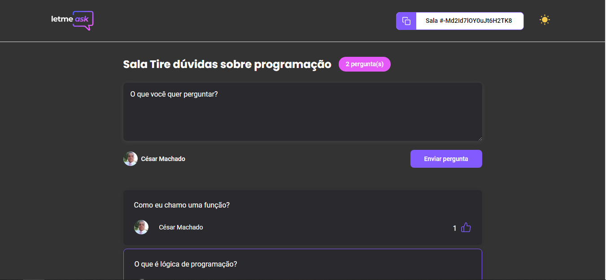

<div align="center">
  
</div>

## Let Me Ask

<h4 align="center">
  Let Me Ask é uma plataforma aonde você pode fazer perguntas sobre um assunto e os usuários poderão responder, votar pelas melhores perguntas e o mais importante poderão ajudar outras pessoas que estão com dúvidas.
</h4>

<h4 align="center"> Tela principal,light e dark mode.</h4>


<h4 align="center"> Tela do Usuário, light e dark mode</h4>




<h4 align="center"> Tela do criador da sala ou admin, light e dark mode.</h4>


<h4 align="center"> Responsividade aplicada no projeto</h4>

<div>


</div>

## Tecnologias usadas nesse projeto.

- [ReactJS](https://reactjs.org/)
- [Typescript](https://www.typescriptlang.org/)
- [Firebase Authentication](https://firebase.google.com/products/auth)
- [Firebase Realtime Database](https://firebase.google.com/products/realtime-database)

### Requerimentos para que você veja o projeto.

- Você Precisa instalar o [Node.js](https://nodejs.org/en/download/) e [Yarn](https://yarnpkg.com/) ou pode usar o Npm que já vem quando você instala o Nodejs.

**Clone o projeto e entre na pasta**

```bash
$ git clone https://github.com/cesar-machado/Letmeask && cd letmeask
```

**Siga os passos abaixo para rodar o projeto**

```bash
# Install the dependencies
$ yarn

# Remember to configure your .env.local following the .env.exemple

# Run the web server
$ yarn start
```

O projeto estará disponível no seu navegador em `http://localhost:3000`

## 📝 License

This project is licensed under the MIT License - see the [LICENSE](LICENSE) file for details.

---

Feito com muito 💜 by César Machado 👋 [Meu LinkedIn](https://www.linkedin.com/in/cesar-mach/)
